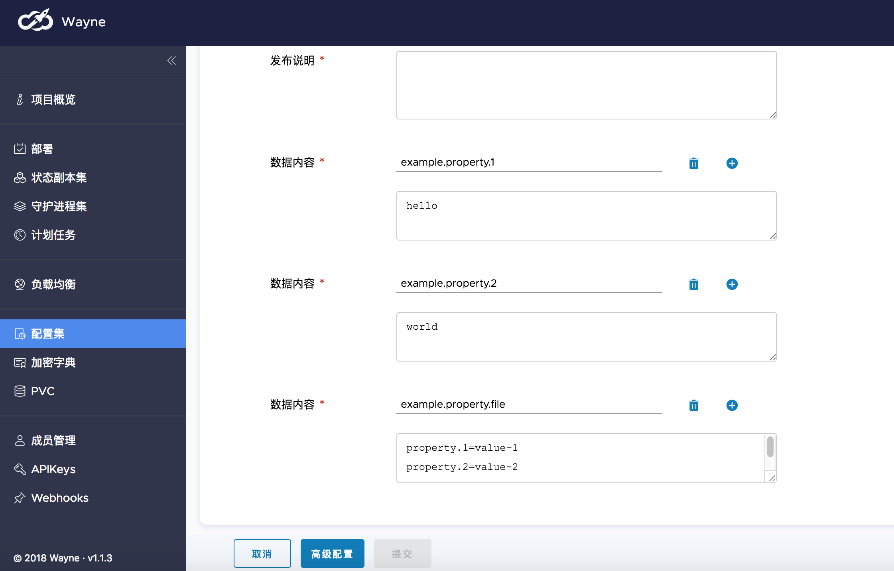

# ConfigMap（用户端）

## 定义

ConfigMap 允许您将配置与应用程序分离，以使应用程序可移植。创建好 ConfigMap 后可以通过挂载文件或者环境变量的形式来使用。

## 示例


### 例如有以下 ConfigMap



高级模式详情如下：

``` yaml
kind: ConfigMap
apiVersion: v1
metadata:
  name: five-nginx
  namespace: default
  labels:
    wayne-app: my-first
    wayne-ns: demo
    app: five-nginx
data:
  example.property.1: hello
  example.property.2: world
  example.property.file: |-
    property.1=value-1
    property.2=value-2
    property.3=value-3
```

### 使用方式：

#### 1. 填充环境变量


高级模式使用示例：

``` yaml
apiVersion: v1
kind: Pod
metadata:
  name: dapi-test-pod
spec:
  containers:
    - name: test-container
      image: gcr.io/google_containers/busybox
      command: [ "/bin/sh", "-c", "env" ]
      env:
        - name: SPECIAL_LEVEL_KEY
          valueFrom:
            configMapKeyRef:
              name: example-config     #需要使用的 ConfigMap 名称，必须已经存在
              key: example.property.1  #对应 ConfigMap data 的 key
  restartPolicy: Never
```

设置结果

```
SPECIAL_LEVEL_KEY=hello
```

#### 2. 设置容器启动命令行参数

**仅支持高级模式**

``` yaml
apiVersion: v1
kind: Pod
metadata:
  name: dapi-test-pod
spec:
  containers:
    - name: test-container
      image: gcr.io/google_containers/busybox
      command: [ "/bin/sh", "-c", "echo $(SPECIAL_LEVEL_KEY) $(SPECIAL_TYPE_KEY)" ]
      env:
        - name: SPECIAL_LEVEL_KEY
          valueFrom:
            configMapKeyRef:
              name: example-config
              key: example.property.1
        - name: SPECIAL_TYPE_KEY
          valueFrom:
            configMapKeyRef:
              name: example-config
              key: example.property.2
  restartPolicy: Never
```

运行结果：

```
hello world
```

####  3. 挂载 ConfigMap 到文件

**仅支持高级模式**

``` yaml
apiVersion: v1
kind: Pod
metadata:
  name: dapi-test-pod
spec:
  containers:
    - name: test-container
      image: gcr.io/google_containers/busybox
      command: [ "/bin/sh","-c","ls -l /etc/config/path/" ]
      volumeMounts:
      - name: config-volume
        mountPath: /etc/config
  volumes:
    - name: config-volume
      configMap:
        name: example-config
  restartPolicy: Never
```

创建的文件如下：

```
etc
└── config
    ├── example.property.1
    │  
    ├── example.property.2
    │   
    └── example.property.file
        
        
#cat example.property.1          hello
#cat example.property.2          world
#cat example.property.file  
    property.1=value-1
    property.2=value-2
    property.3=value-3    
```
> **注意：** 
- ConfigMap 必须在使用之前被创建，如果引用了一个不存在的 configMap，将会导致 Pod 无法启动
- ConfigMap 只能被相同 namespace 内的应用使用。

#####  3.1 挂载 ConfigMap 到单个文件：

**仅支持高级模式**


假设我的项目结构如下 (项目路径为 /usr/local)：

```
.
├── Dockerfile
├── Makefile
├── app.conf
├── controllers
│   └── pod.go
└── main.go
```

我只想把 app.conf 文件从 ConfigMap 挂载进来，其他文件保持不变，现在应该怎么做呢？
好，我们开始。

假设我的 ConfigMap 如下：

```yaml
apiVersion: v1
kind: ConfigMap
metadata:
  name: test-cfgmap
data:
  app.conf: file data
```

- 第一种方式：

可以使用下面的定义文件使用 ConfigMap：

```yaml
apiVersion: v1
kind: Pod
metadata:
  name: test-pd-plus-cfgmap
spec:
  containers:
  - image: ubuntu
    name: bash
    volumeMounts:
    - mountPath: /usr/local/app.conf
      name: cfgmap
      subPath: app.conf
  volumes:
  - name: cfgmap
    configMap:
      name: test-cfgmap
```

> 注意，ConfigMap 的 key、 volumeMounts.mountPath 和 volumeMounts.subPath 名称一定要保持一致，否则会挂载不成功。

- 第二种方式：

```yaml
apiVersion: v1
kind: Pod
metadata:
  name: test-pd-plus-cfgmap
spec:
  containers:
  - image: ubuntu
    name: bash
    volumeMounts:
    - mountPath: /usr/local/app.conf
      name: cfgmap
      subPath: app.conf
  volumes:
  - name: cfgmap
    configMap:
      name: test-cfgmap
      items:
      - key: app.conf
        path: app.conf
```

> 注意，这种方式使用 ConfigMap，就不再要求 ConfigMap 的 key 跟挂载的文件名必须一致，但需要在 items 指定 key 和 path 对应关系。

- 其它方式：

当然，如果你愿意，你也可以挂载 ConfigMap 到一个其它 ** 路径 **，然后通过软连接的方式链接到你需要的文件。

### 实际使用例子（Redis 配置）：

例如当我们需要按照如下配置来启动 Redis

```
maxmemory 2mb
maxmemory-policy allkeys-lru
```

首先，让我们来创建一个 ConfigMap：

```yaml
apiVersion: v1
data:
  redis-config: |
    maxmemory 2mb
    maxmemory-policy allkeys-lru
kind: ConfigMap
metadata:
  name: example-redis-config
  namespace: default
```

下面我们来创建一个 Pod 来使用它：

```yaml
apiVersion: v1
kind: Pod
metadata:
  name: redis
spec:
  containers:
  - name: redis
    image: kubernetes/redis:v1
    env:
    - name: MASTER
      value: "true"
    ports:
    - containerPort: 6379
    volumeMounts:
    - mountPath: /redis-master
      name: config
  volumes:
    - name: config
      configMap:
        name: example-redis-config
        items:
        - key: redis-config
          path: redis.conf     #指定生成的配置文件名称
```

当我们创建完 Pod 后，进入它：
生成的配置文件如下：

```
redis-master
`-- redis.conf -> ..data/redis.conf
```

我们发现在 redis-master 目录下生成了一个文件 redis.conf ，对应我们上面 path 定义的文件名。输出一下 redis.conf 内容：

```
maxmemory 2mb
maxmemory-policy allkeys-lru
```

下面我们看一下 redis 的配置：

```
$ kubectl exec -it redis redis-cli
127.0.0.1:6379> CONFIG GET maxmemory
1) "maxmemory"
2) "2097152"
127.0.0.1:6379> CONFIG GET maxmemory-policy
1) "maxmemory-policy"
2) "allkeys-lru"
```

符合我们的预期。

> **注意：** 虽然使用 configMap 可以很方便的把我们配置文件放入到容器中，但一定注意配置文件的大小，（尽量控制在 1M 以内）更不能滥用 ConfigMap，否则可能会给 apiserver 和 etcd 造成较大压力，影响整个集群。
